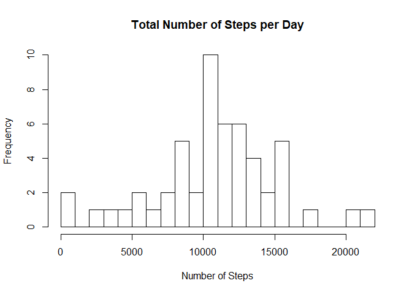
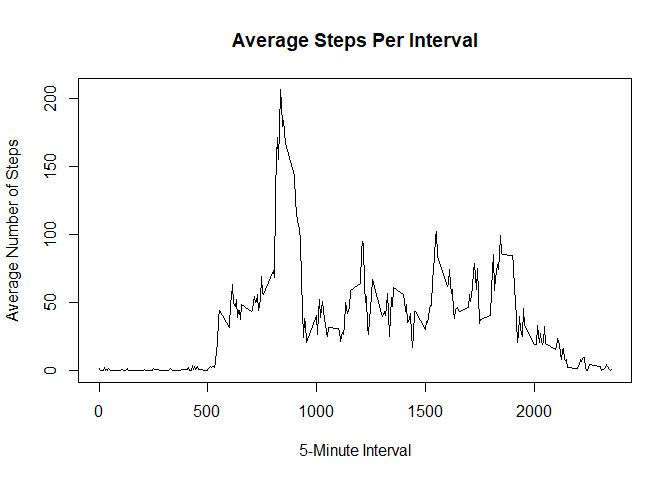
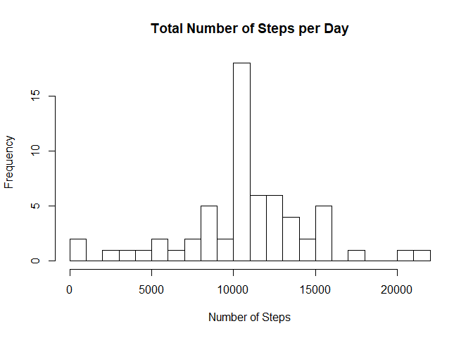
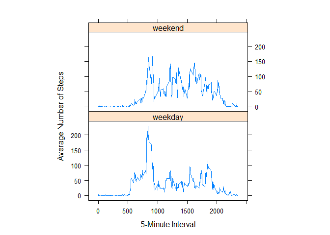

## Setup

```r
   library(ggplot2)
   library(data.table)
   library(lattice)
```

## Loading and preprocessing the data

```r
   # Unzip and load data
   file <- unzip("activity.zip")
   data <- read.csv(file, header=TRUE,sep=",")
   
   # Change date format
   data$date <- as.Date(data$date,"%Y-%m-%d")
```


## What is mean total number of steps taken per day?

```r
   # Calculate number of steps taken per day
   numSteps <- aggregate(steps~date,data,FUN=sum)

   # Plot histogram of total steps each day
   totSteps <- hist(numSteps[,2], breaks=25,
                    main="Total Number of Steps per Day", 
                    xlab="Number of Steps", ylab="Frequency")
```

<!-- -->

```r
   # Calculate mean and median of total steps per day
   meanStep <- mean(numSteps$steps)
   medStep <- median(numSteps$steps)
   
   sprintf("Mean: %f", meanStep)
```

```
## [1] "Mean: 10766.188679"
```

```r
   sprintf("Median: %d", medStep)
```

```
## [1] "Median: 10765"
```

The average of total number steps taken per day is `1.0766189\times 10^{4}`.

The median total steps taken per day is `10765`.


## What is the average daily activity pattern?

```r
   # Time series plot
   ## 5-min interval vs Avg num steps taken
   stepInt <- aggregate(steps~interval, data, FUN=mean)
   stepAvg <- plot(stepInt, type="l", 
                   main="Average Steps Per Interval", 
                   xlab="5-Minute Interval", ylab="Average Number of Steps")
```

<!-- -->

```r
   # Interval with max num steps
   maxInt <- stepInt[which.max(stepInt$steps),1]
   sprintf("Interval w/Max Avg Steps: %d", maxInt)
```

```
## [1] "Interval w/Max Avg Steps: 835"
```

The 5-minute interval, averaging all days in the dataset, with the maximum number of steps is `835`.

## Imputing missing values

```r
   # Calculate total number of missing values
   totNA <- sum(is.na(data))
   sprintf("Number of missing values: %d",totNA)
```

```
## [1] "Number of missing values: 2304"
```

```r
   # Fill in missing values w/avg of that 5 minute interval to new dataset
   ndata <- data
   for(i in 1:length(ndata[,1]))
   {
      if(is.na(ndata[i,1]))
      {
         temp <- which(stepInt[,1]==ndata[i,3])
         ndata[i,1] <- stepInt[temp,2]
      }
   }

   # Histogram of total steps taken
   nnumSteps <- aggregate(steps~date,ndata,FUN=sum)
   ntotSteps <- hist(nnumSteps[,2], breaks=25,
                     main="Total Number of Steps per Day",
                     xlab="Number of Steps", ylab="Frequency")
```

<!-- -->

```r
   # Mean and Median of steps taken per day
   nmeanStep <- mean(nnumSteps$steps)
   nmedStep <- median(nnumSteps$steps)
   
   sprintf("Mean: %f", nmeanStep)
```

```
## [1] "Mean: 10766.188679"
```

```r
   sprintf("Median: %f", nmedStep)
```

```
## [1] "Median: 10766.188679"
```

The total number of missing values in the dataset is `2304`.

The mean of the total number of steps taken per day of the new dataset is `1.0766189\times 10^{4}`.

The standard deviation of the total number of steps taken per day of the new dataset is `1.0766189\times 10^{4}`.

The mean does not differ from the estimates of the first part of the assignment, while the median slightly increased to match the mean of the new dataset. There does not seem to be a significant impact on the estimates of the total daily number of steps.

## Are there differences in activity patterns between weekdays and weekends?

```r
   # New factor variable: "weekday" and "weekend"
   ndata$day <- weekdays(ndata$date)
   ndata$dayType[ndata$day %in% c("Saturday", "Sunday")] <- "weekend"
   ndata$dayType[!(ndata$day %in% c("Saturday","Sunday"))] <- "weekday"
   
   # Panel Plot of intervals vs avg steps taken 
   nstepInt <- aggregate(steps~interval+dayType, ndata, FUN=mean)
   
   nstepAvg <- xyplot(steps~interval | dayType,
                      data=nstepInt, type="l", cex=2, aspect=1/2, 
                      xlab="5-Minute Interval", ylab="Average Number of Steps")

   print(nstepAvg)
```

<!-- -->
